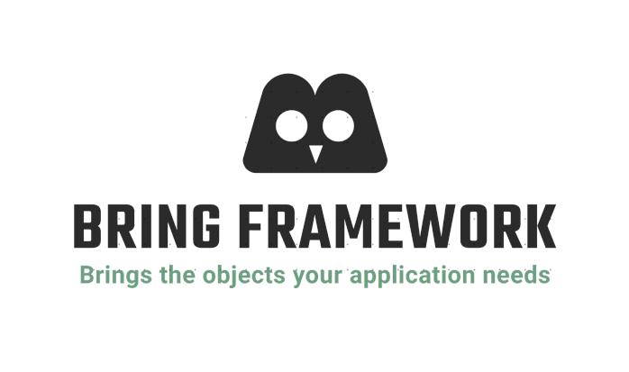

## Overview
Bring framework is a small project which is self-written dependency injection 
container with learning purpose.
## Building
In order to add our DI container to your project, you need to do these steps:

First, add a jitpack.io resource to your `pom.xml` file:

    <repositories>
        <repository>
            <id>jitpack.io</id>
            <url>https://jitpack.io</url>
        </repository>
    </repositories>
Second, add dependency of our project:

    <dependency>
        <groupId>com.github.b-bodnar</groupId>
        <artifactId>bring-framevork</artifactId>
        <version>2e133860b0f2c68995420dbcdf766260d54367b8</version>
    </dependency>

Third, add these lines in your main class to get application context:

        ApplicationContext context = Application.run(nameOfYourPackageToScan);

And that pretty much it. It will scan your package to find all the interfaces and implementation classes, that are marked 
with `@Component` annotation.
If you want to inject services please use field injection with `@Autowired` annotation. Constructor injection is not yet 
supported.
For example, this is format of injecting `FirstService` inside `SComponent` class:

    public class SComponent {

     @Autowired
     private FirstService firstService;

If your interface or service has multiple implementations, after `@Autowired` annotation do not forget to add `@Qualifier `
annotation with name of the implementation as a value:

    @Autowired
    @Qualifier("SecondServiceImpl")
    private SecondService secondService;

Also do not forget to add an `application.properties` file to your project to avoid exception related to it.
If you want to get some parameters from application.properties files firstly you need to add them there and secondly
add `@Value` annotation with a name of needed property above the field. Or you can leave the value blank if the name 
of the property is the same as the name of the field.
Example:

    @Value("")
    private String alcohol;

## Troubleshooting
Describes what problems can be faced and how to solve them

## Release Notes
Can be found in [RELEASE_NOTES](RELEASE_NOTES.md).

## Authors
* Maryna Melnychuk - [marynamelnichuk](https://github.com/marynamelnichuk)
* Rostyslav Sapeliuk - [rsapeliuk](https://github.com/rsapeliuk)
* Serhii Halchynskyi - [imptah](https://github.com/imptah)
* Nazar Senyk - [nrikoklsd](https://github.com/nrikoklsd)
* Yurii Zaluskyi - [YuraZaluskyi](https://github.com/YuraZaluskyi)
* Alexander Maister - [maisterkm](https://github.com/maisterkm)
* Andrii Androsiuk
* Bohdan Bodnar - [b-bodnar](https://github.com/b-bodnar)

## License
This project is Apache License 2.0 - see the [LICENSE](LICENSE) file for details
